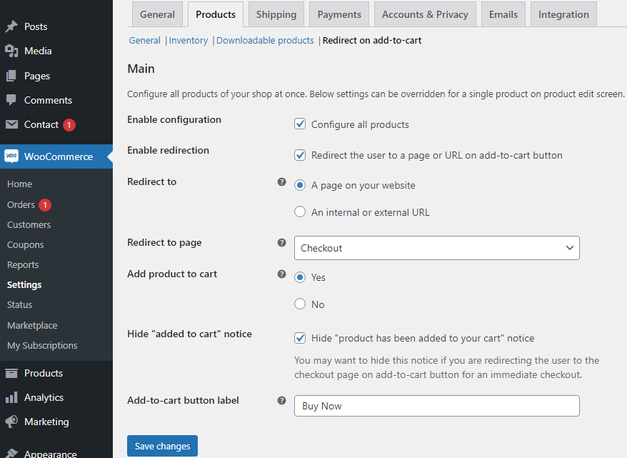
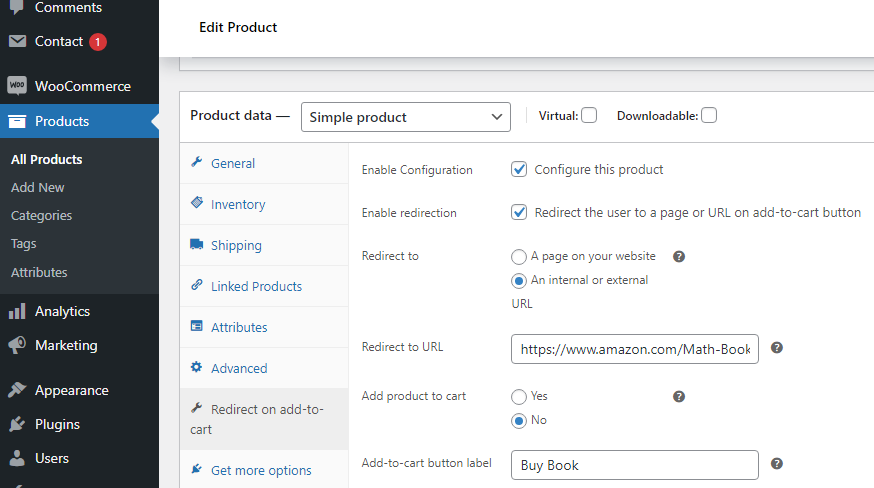

## Introduction

WooCommerce Redirect To Page or URL on Add To Cart - Direct Checkout or Skip Cart plugin lets you redirect the user to a page on your website or internal/external URL on add-to-cart button. You can enable this redirection for all or selected products. You can also control add-to-cart button behavior - whether it adds product to cart or not, whether it shows "product has been added to cart" message or not. You can also change the add-to-cart button label for all or selected products for both archive (e.g. shop page) and single product pages regardless of whether redirection is turned on for it or not.

### Features
- For all or selected products
  - Enable redirection on add-to-cart button
  - Set custom label for add-to-cart button
- Redirection
  - Redirect to a page on your website
  - Redirect to any URL - an internal or external URL
  - Skip addition to cart (helpful when you redirect the user to an external URL)
  - Hide "product has been added to cart message" (helpful when you redirect the user to checkout page)
- Global and Product level settings
    - Override global settings at product level or just configure at product level

## Installation

### Minimum Requirements

- PHP 5.6 or greater is recommended
- Wordpress 5.0 or greater
- Woocommerce 4.1 or greater

### Manual installation

Manual installation method requires downloading this plugin and uploading it to your web server via your favorite FTP application. The WordPress codex contains [instructions on how to do this here](https://wordpress.org/support/article/managing-plugins/#manual-plugin-installation).

### Updating

Please use [Evneto Market WordPress](https://envato.com/market-plugin/) plugin to update the plugin. If you need help in using this plugin, please read [Update themes automatically using Envato Market plugin](https://seventhqueen.com/support/general/article/update-themes-automatically-using-envato-market-plugin).

## Configuration

Plugin provides global and product level settings.

### Global Level

- There are two ways to open it:
  1. Open "WooCommerce Settings" page in Dashboard (Dashboard -> WooCommerce -> Settings). Switch to "Products" tab and then open "Redirect on add-to-cart" sub-tab.
  2. Open "Plugins" page in Dashboard (Dashboard -> Plugins). Scroll down to reach "WooCommerce Redirect To Page or URL on Add To Cart" entry. Click "Settings" link in this entry to to open global settings.

### Product Level

- Open "Product List" page in Dashboard (Dashboard -> Products).
- Open the product you want to edit from the product list.
- Scroll down to data panels and open "Redirect on add-to-cart" data panel.

## Usage

- **To Change default global settings**
  - Open global settings as descirbed in [configuration](#global-level)
  - Make and save changes

- **To override global settings or just configure at product level**
  - Open product settings as descirbed in [configuration](#product-level)
  - Make and save changes

## Changelog

**2022-02-11 - Version 1.0.0**
  - Initial Release
